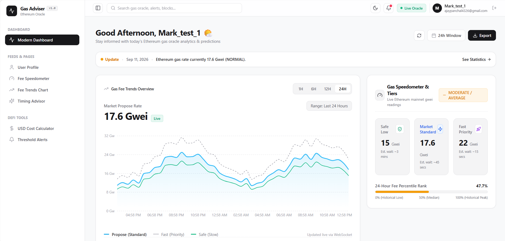
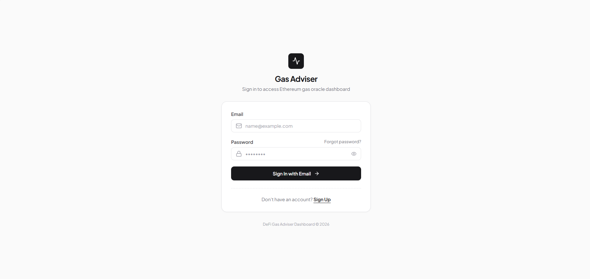
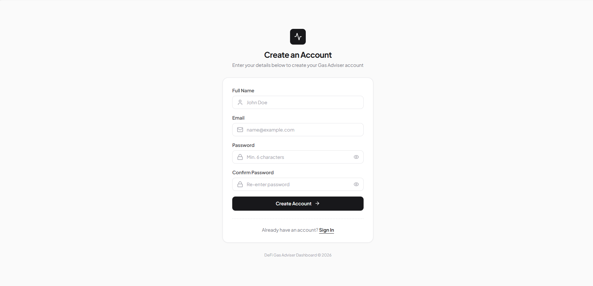
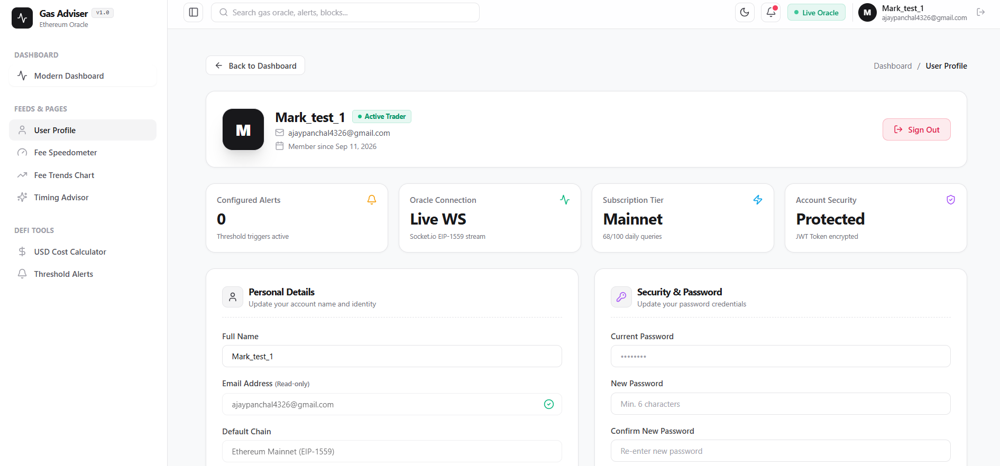

# Gas Adviser IO ⛽
> Your intelligent DeFi Gas Fee Predictor & Timing Optimization Platform

[](https://github.com/DeadlyPro34/Carbon-Emissions-Agent)
[](https://opensource.org/licenses/MIT)
[]()
[]()
[]()

---

## 📌 Project Overview

**Gas Adviser IO** is a robust, real-time DeFi application built to solve one of the biggest pain points in Web3: unpredictable and exorbitant gas fees. 

**The Problem:** Transacting on Ethereum can be expensive. Users often overpay for transactions during network congestion or get their transactions stuck because they underpriced them. 
**The Solution:** Gas Adviser IO continuously monitors the blockchain, predicts optimal transaction times, and provides a real-time dashboard with historical percentiles, custom alerts, and transaction cost calculators.

**Target Users:** Crypto traders, DeFi users, NFT minters, and Web3 developers who need to optimize their transaction costs.

**Main Objectives:**
- Provide real-time, ultra-fast gas price updates via WebSockets.
- Allow users to set custom threshold alerts so they never miss low-gas opportunities.
- Offer actionable advice (Wait vs. Transact) based on 24-hour historical fee percentiles.

---

## 📸 Screenshots / Preview

### Dashboard & Real-Time Analytics

*Live gas metrics, historical charts, and transaction cost calculators in a sleek glassmorphism UI.*

### Secure Authentication (Login)

*Beautiful, secure login portal with floating gradient aesthetics.*

### Account Creation (Register)

*Registration with real-time password strength indicators.*

### User Profile

*Manage your account settings and preferences.*

---

## 🌐 Demo

**Live Demo:**  
*[Insert Live URL Here]*

**Video Demo:**  
*[Insert YouTube/Loom Link Here]*

---

## ✨ Features

### Core Features
- **Real-Time Gas Tracking:** Live updates of Safe, Propose, and Fast Gwei metrics using Socket.io.
- **Percentile-Based Recommendations:** Smart logic that advises you whether to transact now or wait, based on the last 24 hours of network activity.
- **Transaction Cost Calculator:** Convert current Gwei into USD costs for common operations (ETH Transfer, ERC20 Transfer, Uniswap Swap).
- **Custom Price Alerts:** Set a Gwei threshold and get notified instantly when gas drops below your target.

### Authentication Features
- **Secure Login & Signup:** JWT-based stateless authentication.
- **Password Encryption:** Passwords securely hashed via `bcryptjs`.
- **OTP Password Reset:** Forgot password flow utilizing 6-digit OTPs sent via Nodemailer (Gmail SMTP).

### Dashboard Features
- **Historical Fee Charts:** Interactive Recharts visualizing gas trends over the selected time horizon.
- **Glassmorphism UI:** Premium, modern dark-mode aesthetic with vibrant gradients and micro-animations.
- **Health Panel:** Real-time backend and MongoDB connectivity status.

---

## 🛠️ Technology Stack

**Frontend:**
- React (Vite)
- Tailwind CSS (Custom Glassmorphism Utilities)
- Recharts (Data Visualization)
- Axios (HTTP Client)
- Socket.io-client
- Lucide React (Icons)

**Backend:**
- Node.js
- Express.js
- Socket.io (WebSockets)
- Nodemailer (Email/OTP delivery)
- Node-Cron (Background polling)

**Database:**
- MongoDB Atlas
- Mongoose (ODM)

**Authentication:**
- JSON Web Tokens (JWT)
- bcryptjs

**Other Tools:**
- Etherscan API (Blockchain Oracle)
- node:test (Native Backend Testing)

---

## 🏗️ System Architecture

```text
       [ User Browser ]
              │
  (React + Context API + JWT)
              │
    ┌─────────┴─────────┐
    │                   │
[ REST API ]     [ WebSockets ] 
 (Express)        (Socket.io)
    │                   │
    ├───────────────────┘
    │
[ Node.js Backend Engine ] ─── (node-cron) ─── [ Etherscan API ]
    │
[ MongoDB Atlas ] (Users, Alerts, Fee History)
```

**Flow Explanation:** The Node.js backend uses a cron job to poll the Etherscan API every 20 seconds. It saves this data to MongoDB and instantly broadcasts it to all connected React clients via Socket.io. When fees drop, the backend checks all user-configured alerts and emits targeted trigger events to the frontend.

---

## 📁 Project Structure

```text
gas-adviser-io/
│
├── client/                 # Frontend React Application
│   ├── public/
│   ├── src/
│   │   ├── components/     # UI Components (Charts, Calculators, Alerts)
│   │   ├── context/        # Global State (AuthContext)
│   │   ├── pages/          # Full Page Views (Login, Dashboard)
│   │   ├── App.jsx         # Routing & Socket Logic
│   │   └── index.css       # Global Styles & Glassmorphism Tokens
│   └── package.json
│
├── server/                 # Backend Node.js Application
│   ├── helpers/            # Fee Logic, Email/OTP logic
│   ├── jobs/               # Background Cron Jobs (pollFees)
│   ├── middleware/         # JWT Verification
│   ├── models/             # Mongoose Schemas (User, UserAlert, FeeHistory)
│   ├── routes/             # REST Endpoints (Auth, Alerts, Fees)
│   ├── services/           # External API Connectors (Etherscan)
│   ├── tests/              # API & Unit Tests
│   ├── server.js           # Express/Socket.io Entry Point
│   └── package.json
│
├── assets/                 # Project images and screenshots
├── .gitignore
└── README.md
```

---

## 🚀 Installation & Setup Guide

### Step 1: Clone Repository

```bash
git clone https://github.com/DeadlyPro34/Carbon-Emissions-Agent.git
cd Carbon-Emissions-Agent/gas-adviser-io
```

### Step 2: Install Dependencies

**For Backend:**
```bash
cd server
npm install
```

**For Frontend:**
```bash
cd ../client
npm install
```

### Step 3: Setup Environment Variables

In the `server/` directory, create a `.env` file:

```env
# MongoDB Connection String (Atlas or Local)
MONGO_URI=mongodb+srv://<username>:<password>@cluster.mongodb.net/defi-gas-predictor

# Etherscan API Key (Get free at etherscan.io)
ETHERSCAN_API_KEY=your_api_key_here

# JWT Secret for Auth Signatures
JWT_SECRET=your_super_secret_string

# Gmail SMTP Credentials for OTPs (Use an App Password)
EMAIL_USER=your-email@gmail.com
EMAIL_PASS=your-google-app-password
```

### Step 4: Start Application

**Start the Backend (Terminal 1):**
```bash
cd server
npm run dev
```

**Start the Frontend (Terminal 2):**
```bash
cd client
npm run dev
```

Your application will now be running at `http://localhost:5173`.

---

## 💡 Usage Guide

1. **Register/Login:** Navigate to the landing page and create a secure account.
2. **Monitor Dashboard:** Watch the live gas fees update every 20 seconds. 
3. **Analyze Trends:** Use the "Timeframe" toggles on the chart to view historical data (1H, 24H, 7D).
4. **Calculate Costs:** Select a transaction type (Swap, Transfer) to see exactly how much it will cost in USD right now.
5. **Set Alerts:** Input a target Gwei amount in the Alerts panel. When the network congestion drops below your target, you will receive a real-time notification on your dashboard.

---

## 📚 API Documentation

### Authentication `/api/auth`
| Method | Endpoint | Description | Auth Required |
|--------|----------|-------------|---------------|
| POST | `/register` | Create a new user account | No |
| POST | `/login` | Authenticate and receive JWT | No |
| GET | `/me` | Verify JWT and return user profile | Yes |
| POST | `/forgot-password` | Send 6-digit OTP to email | No |
| POST | `/reset-password` | Verify OTP and set new password | No |

### Gas Fees `/api/fees`
| Method | Endpoint | Description | Auth Required |
|--------|----------|-------------|---------------|
| GET | `/current` | Get the latest fee reading | No |
| GET | `/history?hours=X` | Get historical fees (max 168 hours) | No |

### Alerts `/api/alerts`
| Method | Endpoint | Description | Auth Required |
|--------|----------|-------------|---------------|
| GET | `/` | Fetch all active alerts for logged-in user | Yes |
| POST | `/` | Create a new threshold alert (max 10/user) | Yes |
| DELETE | `/:id` | Delete a specific alert | Yes |

---

## 🔐 Security Features

- **Authentication:** Stateless JSON Web Tokens (JWT) stored in secure local storage.
- **Authorization:** `authMiddleware` rigorously guards protected routes. Users can only fetch and delete their *own* alerts.
- **Encryption:** `bcryptjs` utilized for pre-save password hashing. Plain text passwords never touch the database.
- **Rate Limiting:** Users are capped at 10 active alerts to prevent database bloat and abuse. History API queries are clamped to a maximum 168-hour lookback.
- **Obfuscation:** Auth endpoints return generic error messages to prevent email enumeration attacks.

---

## ⚡ Performance Optimizations

- **WebSocket Broadcasting:** `Socket.io` pushes data to clients instantly, eliminating the need for client-side HTTP polling and drastically reducing server load.
- **In-Memory Fallback:** The backend is fully capable of running offline/without MongoDB using an intelligent in-memory mock data generator.
- **Index Optimization:** Mongoose schemas utilize indexing (e.g., `userId` on Alerts) to ensure $O(1)$ and $O(\log N)$ query performance as the user base grows.

---

## ☁️ Deployment

**Backend (Render / Railway):**
1. Connect your GitHub repository.
2. Set Root Directory to `server`.
3. Build Command: `npm install`
4. Start Command: `npm start`
5. Add all `.env` variables to the dashboard.

**Frontend (Vercel / Netlify):**
1. Connect GitHub repository.
2. Set Root Directory to `client`.
3. Add environment variable: `VITE_API_URL=https://your-deployed-backend-url.com`
4. Deploy.

---

## 🧪 Testing

The backend includes a comprehensive, dependency-free integration testing suite using the native `node:test` runner.

```bash
cd server
npm test
```
*Tests cover fee calculation logic, percentile mathematics, and deep alert ownership/isolation security checks.*

---

## 🗺️ Roadmap / Future Improvements

- **Compare Chains:** Side-by-side comparison of Gas fees across Layer 2s (Arbitrum, Optimism, Polygon, Base).
- **Push Notifications:** Web Push API integration for mobile and desktop notifications when the app is closed.
- **Web3 Wallet Login:** Sign in with MetaMask / WalletConnect alongside traditional email.
- **AI Gas Prediction:** Implement machine learning models to forecast gas fees 12-24 hours in advance.

---

## 👥 Contributors

| Name | Role | GitHub |
|------|------|--------|
| **Akhil (DeadlyPro34)** | Full-Stack Architect | [@DeadlyPro34](https://github.com/DeadlyPro34) |
| **Vivek (vivekchityal24-cyber)** | Backend Engineer | [@vivekchityal24-cyber](https://github.com/vivekchityal24-cyber) |
| **Ajay (Ajaypanchal4326)** | Frontend Developer | [@Ajaypanchal4326](https://github.com/Ajaypanchal4326) |
| **Jash (2501031830014-dot)** | QA & Testing | [@2501031830014-dot](https://github.com/2501031830014-dot) |

---

## 🤝 Contributing Guidelines

1. Fork the repository
2. Create your feature branch (`git checkout -b feature/AmazingFeature`)
3. Commit your changes (`git commit -m 'Add some AmazingFeature'`)
4. Push to the branch (`git push origin feature/AmazingFeature`)
5. Open a Pull Request

---

## 📄 License

This project is licensed under the **MIT License**.

---

